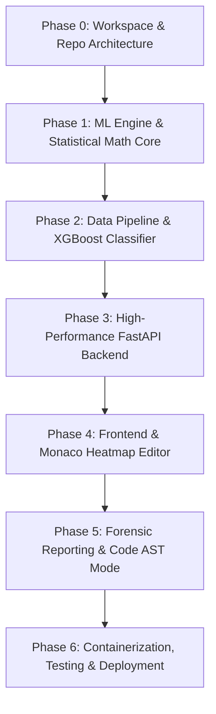

# DeepScan / Forensic AI Detector: Master Implementation Plan

> **Document Version:** 1.0.0  
> **Source Specification:** [deepscan_project_report.md](file:///c:/Users/AnshulKanodia/Downloads/project/DeepScan/deepscan_project_report.md)  
> **Target Scope:** Dual-engine (Text + Code) AI Forensic Detection Platform using Local Perplexity, Burstiness & XGBoost.

---

## 1. Project Naming Strategy

*Note: "DeepScan" is a widely recognized static analysis tool for JavaScript/TypeScript (deepscan.io). While you can keep it as an internal codename, here are curated, brandable alternatives suitable for open-source and commercial positioning:*

| Name | Tagline / Vibe | Pros | Cons / Notes |
| :--- | :--- | :--- | :--- |
| **VeritasAI** | *Veritas: Truth in Latin.* The Truth Engine for Text & Code. | Academic weight, authoritative, ideal for audits. | Slightly formal. |
| **AegisText** / **AegisScan** | AI Shield & Provenance Validator. | Security-oriented, strong enterprise feel. | "Aegis" is common in security. |
| **GhostTrace** | Unmasking synthetic ghosts in prose & code. | Punchy, memorable, developer-friendly. | Slightly edgy / hacker-aesthetic. |
| **PrismForensics** (or **PrismAI**) | Refracting text into statistical light spectrums. | Matches the sentence-level Monaco heatmap concept. | "Prism" has existing software names. |
| **Synthetix** | Synthetic Content & Code Inspector. | Modern, cyber, sounds cutting-edge. | Often confused with crypto/synthetics. |
| **DeepScan AI** *(Retain Original)* | Forensic AI Detector. | Direct, already in your report. | Potential SEO overlap with deepscan.io. |

> **Recommendation:** **VeritasAI** for an academic/forensic audit tool, or **GhostTrace** / **DeepScan AI** for developer and general tech appeal.

---

## 2. Infrastructure & Hosting Architecture

The backend utilizes `transformers` / `onnxruntime` with `distilgpt2` (~300MB in RAM) and `xgboost` (< 5MB), making free and low-cost tiers completely viable if configured correctly.

```
                      +-----------------------------+
                      |   Client Browser (React)    |
                      |   Vercel / Cloudflare Pages |
                      +--------------+--------------+
                                     |
                          HTTPS / REST API Requests
                                     |
                                     v
                      +-----------------------------+
                      |   FastAPI Inference Engine  |
                      |  Hugging Face Spaces / Fly  |
                      |   (Docker / ONNX CPU Opt)   |
                      +--------------+--------------+
                                     |
                      +--------------+--------------+
                      |                             |
                      v                             v
           +--------------------+         +-------------------+
           | Neon / Supabase    |         | Cloudflare R2 / S3|
           | (Serverless PG)    |         | (PDF Audit Store) |
           | Hashed Scans & Logs|         | (Optional Export) |
           +--------------------+         +-------------------+
```

### Hosting Breakdown

| Tier | Component | Recommended Provider | Specs & Cost | Why This Provider? |
| :--- | :--- | :--- | :--- | :--- |
| **Frontend** | React (Vite) SPA | **Vercel** or **Cloudflare Pages** | Free ($0) | Global edge CDN, automated GitHub CI/CD previews, instant deployments. |
| **Backend (Zero-Cost)** | FastAPI + ONNX Runtime | **Hugging Face Spaces** (Docker) | 2 vCPU, 16GB RAM, Free ($0) | **Best free option for ML**: Unlike Render's free 512MB RAM cap (which risks OOM when loading PyTorch/tokenizers), HF Spaces provides generous 16GB RAM free. |
| **Backend (Low-Cost Production)** | FastAPI + ONNX Runtime | **Fly.io** or **Render (Starter)** | 1 vCPU, 1GB–2GB RAM (~$5–$7/mo) | Zero cold-starts, custom domains, raw Docker container control. |
| **Database (Optional)** | Scans & Audits History | **Neon.tech** or **Supabase** | Free Serverless Postgres (0.5GB) | Connection pooling, instant migrations, zero idle billing. |
| **PDF Storage (Optional)** | Forensic Export PDFs | **Cloudflare R2** or Direct Streaming | Free tier (10GB) or Stream in-memory | In-memory streaming directly to browser requires $0 storage. |

---

## 3. End-to-End Implementation Roadmap (Phase-by-Phase)



---

### Phase 0: Workspace Setup & Repository Architecture
*Goal: Establish monorepo structure, dependency managers, formatting, and git hooks.*

- **Directory Layout:**
  ```text
  deepscan/
  ├── backend/
  │   ├── app/
  │   │   ├── api/          # Endpoints (/analyze/text, /analyze/code, /export)
  │   │   ├── core/         # Config, logging, security
  │   │   ├── ml/           # Model loading, ONNX inference, feature extractors
  │   │   └── services/     # Segmentation, AST parsing, PDF builder
  │   ├── models/           # Exported ONNX & XGBoost artifacts
  │   ├── tests/            # Pytest test cases
  │   ├── Dockerfile
  │   ├── requirements.txt
  │   └── main.py
  ├── data_engine/          # Offline training scripts (HC3, DAIGT, CodeSearchNet)
  │   ├── datasets/         # Raw / Processed sample data
  │   ├── train_classifier.py
  │   └── export_onnx.py
  ├── frontend/
  │   ├── src/
  │   │   ├── components/   # MonacoHeatmap, MetricCards, ScoreGauge, Nav
  │   │   ├── hooks/        # useAnalysis, useExport
  │   │   ├── services/     # api client
  │   │   └── App.jsx
  │   ├── package.json
  │   └── vite.config.js
  └── README.md
  ```
- **Deliverables:**
  - Python virtual environment with Poetry or `requirements.txt`.
  - Node.js 20+ Vite React app setup.
  - Pre-commit config (Black/Ruff for Python, ESLint/Prettier for React).

---

### Phase 1: ML Core & Statistical Feature Engine
*Goal: Build the mathematical heart that extracts Perplexity, Burstiness, and Entropy on CPU.*

- **Key Tasks:**
  1. Download and convert `distilgpt2` to an ONNX model with INT8 quantization (reduces model footprint from ~330MB to ~80MB with 3x inference speedup).
  2. Implement text segmentation using `spaCy` (`en_core_web_sm`) or regex sentence tokenizer.
  3. Calculate token-level log-probabilities:
     $$\text{PPL}(S) = \exp\left(-\frac{1}{N} \sum_{i=1}^N \log P(w_i \mid w_{<i})\right)$$
  4. Compute structural Burstiness (Fano Factor / Coefficient of Variation):
     $$\text{Burstiness} = \frac{\sigma_{\text{PPL}}}{\mu_{\text{PPL}}}$$
  5. Compute Top-$K$ token distribution (percentage of tokens falling within top-10, top-100, top-1000 probability ranks).
  6. Unit test on canonical test sentences (e.g. human essay vs ChatGPT output).
- **Deliverables:**
  - `backend/app/ml/onnx_engine.py`
  - `backend/app/ml/features.py`
  - Benchmark script showing < 150ms latency for a 500-word essay.

---

### Phase 2: Data Pipeline & XGBoost Classifier Training
*Goal: Train a classifier on real datasets to convert raw metrics into a calibrated AI confidence score.*

- **Key Tasks:**
  1. **Dataset Ingestion:**
     - Natural Language: Download HC3 (`Hello-SimpleAI/HC3`) or DAIGT V2.
     - Code: Pull human samples from `CodeSearchNet` + generate synthetic AI code (via Groq/Gemini API script).
  2. **Feature Extraction Pipeline:**
     - Extract `[mean_ppl, min_ppl, max_ppl, ppl_variance, burstiness, top10_ratio, top100_ratio, avg_sentence_len]` for 10,000 samples (5k human, 5k AI).
     - Save to `data_engine/datasets/features_train.parquet`.
  3. **Model Training:**
     - Train `XGBClassifier(n_estimators=150, max_depth=4, learning_rate=0.05)`.
     - Calibrate probabilities with Platt Scaling / `CalibratedClassifierCV` so that a 95% score represents genuine confidence.
     - Evaluate metrics: Aim for **AUC-ROC > 0.94** and **F1 > 0.90**.
  4. **Export Artifacts:**
     - Save as `models/xgboost_text_v1.json` (< 1MB).
- **Deliverables:**
  - Standalone training notebook/script `data_engine/train_classifier.py`.
  - Evaluated `.json` or `.joblib` model artifact ready for runtime loading.

---

### Phase 3: High-Performance FastAPI Backend
*Goal: Wrap ML inference in clean, documented REST endpoints with CORS and validation.*

- **Key Tasks:**
  1. Set up FastAPI with Pydantic schemas:
     - Input: `TextAnalysisRequest { content: str, language: str }`
     - Output: `AnalysisResult { overall_ai_score: float, metrics: MetricsData, sentences: List[SentenceAnalysis] }`
     - Each `SentenceAnalysis` contains `{ text: str, start_char: int, end_char: int, ppl: float, ai_probability: float, classification: "human" | "mixed" | "ai" }`.
  2. Implement Source Code Analyzer:
     - Python `ast` module parsing: measures AST depth, cyclomatic complexity, and variable identifier entropy (Shannon entropy of variable names).
  3. PDF Forensic Report Generation:
     - Create PDF builder via `ReportLab` or `WeasyPrint` containing executive summary, sentence table, and timestamped authenticity hash (SHA-256).
  4. Health checks & middleware:
     - CORS settings for Vite frontend.
     - Rate-limiting (e.g. `slowapi` 30 requests/minute).
- **Deliverables:**
  - `/api/v1/analyze/text` (POST)
  - `/api/v1/analyze/code` (POST)
  - `/api/v1/export/pdf` (POST)
  - Swagger UI accessible at `/docs`.

---

### Phase 4: Modern Frontend & Interactive Monaco Heatmap
*Goal: Build a high-aesthetic forensic workspace matching the design guidelines.*

- **Key Tasks:**
  1. **Core Layout:**
     - Dark-mode forensic aesthetic (charcoal, slate, neon accents like emerald green for human, crimson/amber for AI).
     - Dual tabs: "Natural Language / Prose" and "Source Code".
  2. **Monaco Editor Integration:**
     - Mount `@monaco-editor/react`.
     - Use Monaco's `deltaDecorations` API to inject dynamic inline background colors matching sentence spans (`rgba(239, 68, 68, 0.25)` for AI, `rgba(34, 197, 94, 0.25)` for Human).
     - Click on any highlighted sentence to open a tooltip/inspector showing its individual Perplexity and likelihood.
  3. **Statistical Radar & Metric Cards:**
     - Global AI Probability Gauge (e.g. animated circular SVG or radial chart).
     - Cards for Mean Perplexity, Burstiness Score, AST Entropy, and Top-$K$ Distribution.
  4. **Action Bar:**
     - "Analyze Now" button with loading micro-animations.
     - "Sample Presets" button (Human Essay, ChatGPT Essay, Clean Python Code, AI Python Code).
     - "Download Forensic PDF Report" button.
- **Deliverables:**
  - Responsive, polished UI with zero placeholder graphics.
  - Interactive sentence-by-sentence inspector.

---

### Phase 5: Testing, Hardening & Benchmarking
*Goal: Validate accuracy, stress-test memory limits, and containerize.*

- **Key Tasks:**
  1. Backend unit tests using `pytest` (asserting valid scores on known inputs).
  2. Frontend component tests with Vitest or Cypress/Playwright.
  3. Multi-stage `Dockerfile`:
     - Stage 1: Build virtualenv & download pre-quantized ONNX weights.
     - Stage 2: Distroless/Alpine or Slim Debian image (< 350MB total container).
  4. Test Cold Start and RAM consumption: confirm runtime memory stays under 600MB.
- **Deliverables:**
  - Working `Dockerfile` tested via `docker run -p 8000:8000`.
  - Comprehensive `tests/` passing in CI.

---

### Phase 6: Production Deployment & CI/CD
*Goal: Continuous deployment for both frontend and backend.*

- **Key Tasks:**
  1. **Frontend Deployment:** Connect GitHub repo to Vercel or Cloudflare Pages with build command `npm run build`.
  2. **Backend Deployment:**
     - Set up Hugging Face Spaces (Docker Space) or Fly.io app.
     - Configure CORS to allow production frontend domain.
  3. **GitHub Actions:**
     - Linting and unit tests on PR.
     - Automated Docker image build and deploy webhook.
- **Deliverables:**
  - Live production frontend URL.
  - Live API documentation URL.

---

## 4. Git Commit Roadmap & Strategy

Follow the **Conventional Commits** standard: `feat:`, `fix:`, `refactor:`, `test:`, `docs:`, `chore:`, `perf:`.

### Recommended Milestone Commit Checklist

#### Milestone 0: Project Scaffold
- `chore: initialize repository layout and project documentation`
- `chore(backend): setup python environment, dependencies, and linting tools`
- `chore(frontend): scaffold vite react application with tailwindcss`

#### Milestone 1: Core Mathematical Engine
- `feat(ml): implement distilgpt2 onnx model downloader and quantization script`
- `feat(ml): implement text sentence segmenter and character span mapper`
- `feat(ml): add token log-probability and sentence perplexity calculator`
- `feat(ml): implement burstiness index and top-k token distribution metrics`
- `test(ml): add unit tests for perplexity and burstiness extraction`

#### Milestone 2: Dataset & Classifier Pipeline
- `feat(data): add dataset downloader for HC3 and CodeSearchNet samples`
- `feat(data): build batch feature extraction pipeline`
- `feat(ml): train and calibrate xgboost classifier for text detection`
- `feat(ml): export calibrated xgboost model and evaluation metrics report`

#### Milestone 3: Backend API Development
- `feat(api): initialize fastapi application with cors and config management`
- `feat(api): create /api/v1/analyze/text endpoint with pydantic schemas`
- `feat(code): implement python ast parsing and identifier entropy calculator`
- `feat(api): create /api/v1/analyze/code endpoint for source code detection`
- `feat(api): implement forensic pdf report generation with reportlab`
- `test(api): add integration tests for analysis endpoints and edge cases`

#### Milestone 4: Frontend & Monaco Heatmap
- `feat(ui): design dark-mode dashboard layout and typography system`
- `feat(ui): integrate monaco editor with customizable read/write state`
- `feat(ui): implement dynamic sentence heatmap using monaco deltaDecorations`
- `feat(ui): create sentence detail drawer and statistical metric cards`
- `feat(ui): add sample presets for quick demonstration and testing`
- `feat(ui): integrate pdf report download and forensic hash verification`

#### Milestone 5: Optimization & Containerization
- `perf(ml): optimize onnx session execution providers and batch inference`
- `chore(docker): create multi-stage production dockerfile for backend`
- `ci: configure github actions workflow for testing and automated builds`
- `docs: update comprehensive readme with architecture diagram and run instructions`

---

## 5. Next Immediate Steps

1. **Confirm the Project Name:** Choose between **VeritasAI**, **GhostTrace**, or **DeepScan**.
2. **Execute Phase 0 & Phase 1:** Set up repo directories and verify the ONNX `distilgpt2` perplexity calculation script.
